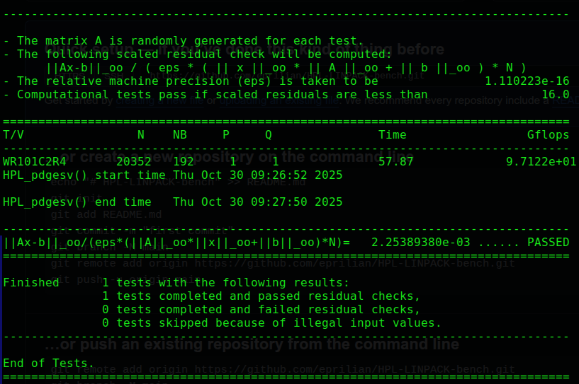

# 🧮 HPL (High Performance Linpack) Installation and Build Guide

This guide provides step-by-step instructions to download, build, and run **HPL (High Performance Linpack)** — a benchmark commonly used to measure the performance of supercomputers.

---

## 📦 Prerequisites

Make sure your system is up-to-date and has the required dependencies installed.

```bash
sudo apt update
sudo apt install build-essential gfortran libopenmpi-dev libopenblas-dev
```

---

## 📥 Download the Source Code

Fetch the official HPL source package from Netlib:

```bash
wget https://www.netlib.org/benchmark/hpl/hpl-2.3.tar.gz
```

Extract the archive:

```bash
tar -xzvf hpl-2.3.tar.gz
mv hpl-2.3
```

---

## 🛠️ Build HPL

Navigate to the setup directory and prepare the build configuration:

```bash
cd hpl/setup
sh make_generic Make.UNKNOW
cp Make.UNKNOW ../Make.linux
nano Make.linux
```

> ⚙️ **Note:** Inside `Make.linux`, adjust paths for your MPI and BLAS libraries as needed or follow my Example-Make.linux.

Then, build HPL with:

```bash
make arch=linux
```

---

## ▶️ Run the Benchmark

Move to the compiled binary directory:

```bash
cd /bin/linux
```

Edit the HPL configuration file:

```bash
nano HPL.dat
```
 > ⚙️ **Note:** Inside `HPL.dat`, adjust paths for your MPI and BLAS libraries as needed or follow my Example-HPL.dat.

Finally, run HPL:

```bash
./xhpl
```

---

## 📚 References

- [HPL Official Site (Netlib)](https://www.netlib.org/benchmark/hpl/)
- [OpenMPI Documentation](https://www.open-mpi.org/doc/)
- [OpenBLAS Documentation](https://www.openblas.net/)

---

## 🧰 Example Output

Once run, HPL will output benchmark results like this:



---

## 🏁 License

This project follows the [HPL license](https://www.netlib.org/benchmark/hpl/).

---

**Author:** *noname.xyz*
**System Tested On:** Ubuntu Linux x86_64
**Version:** HPL 2.3
